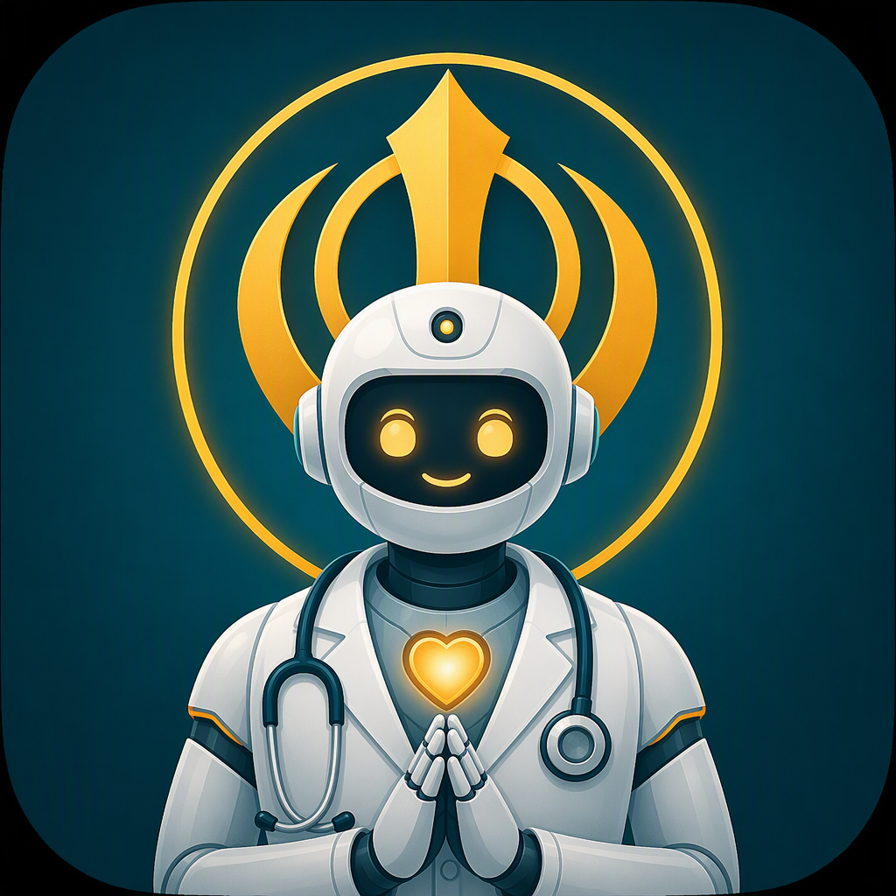
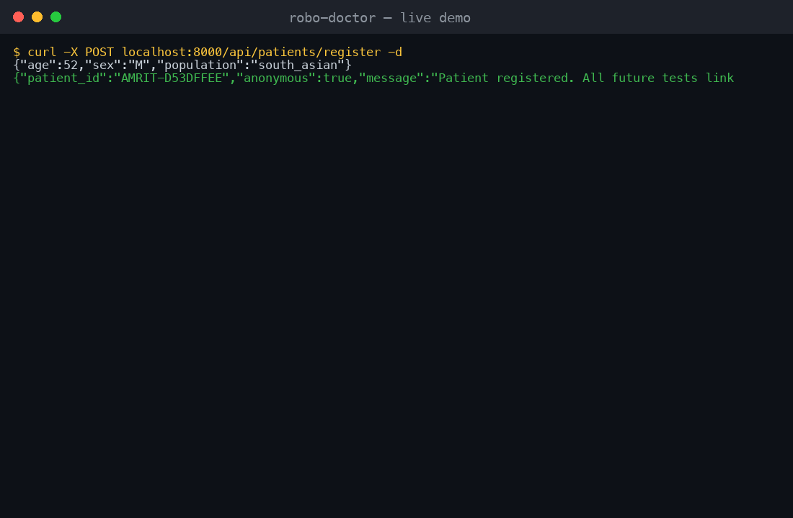
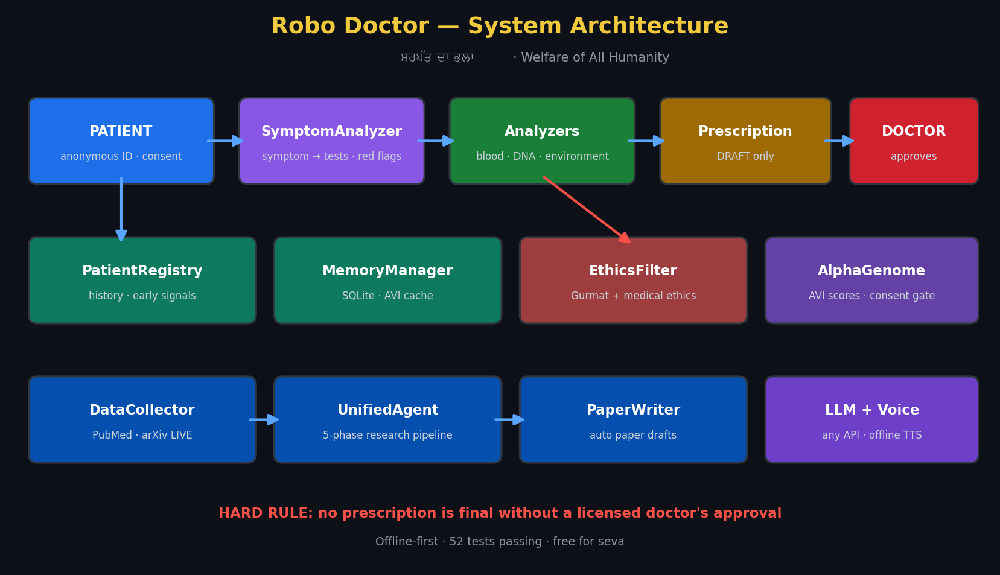

<p align="center">
  
</p>

# Robo Doctor (AMRIT Research OS v6.2)
## Robo Doctor — seva healthcare assistant: research, patient memory, diagnosis support & prescription drafts with mandatory doctor approval

🕉️ **"ਸਰਬੱਤ ਦਾ ਭਲਾ" (Sarbat Da Bhala) - Welfare of All Humanity**

> A robot doctor that remembers every patient, researches real literature
> (PubMed live), analyzes blood/DNA, recommends tests from symptoms, drafts
> prescriptions that **only a licensed doctor can approve**, and speaks to
> patients — built as seva for the poor and underserved.

### Why Robo Doctor is different
- 🔒 **Doctor-in-the-loop by design** — no prescription is ever final without physician approval (hard-coded gate)
- 🧠 **Patient memory** — longitudinal history with early-warning trend detection (catches pre-diabetes before it becomes diabetes)
- 🔬 **Real research** — live PubMed/arXiv literature mining, hypothesis generation, auto paper drafts
- 🧬 **Genomics-ready** — AlphaGenome Atlas integration with consent gate (free non-commercial API)
- 🛡️ **Ethics built-in** — Gurmat + medical ethics filter blocks eugenics, discrimination, consent violations
- 🔌 **Pluggable LLM** — works with Qwen, DeepSeek, OpenRouter, or 100% free local Ollama
- 🗣️ **Voice** — offline text-to-speech, pluggable cloud speech recognition
- 📴 **Offline-first** — core features need no internet, no API keys

---

## 🎬 Live demo — full patient journey in 30 seconds

Register a patient → symptoms become a test list → prescription draft →
**wrong doctor blocked (403)** → real doctor approves:

<p align="center">
  
</p>

Every response above is real module output — no mocks, no staging.

## 🏗️ Architecture

<p align="center">
  
</p>

## 🤝 Join the seva

- [CONTRIBUTING.md](CONTRIBUTING.md) — dev setup in 5 minutes, good first tasks
- [PILOT_CLINIC_GUIDE.md](PILOT_CLINIC_GUIDE.md) — run a real-world clinic pilot
- [LICENSE.md](LICENSE.md) — free forever for seva/charity/research; commercial use needs the founder's permission

---

### Project Vision
AMRIT is a fully autonomous research operating system for medical discovery, 
combining advanced AI with Gurmat (Sikh) ethics to serve humanity—especially 
the poor and underserved who lack access to quality healthcare.

**Founder:** Gurpreet Singh  
**Mission:** Lifelong Seva (Selfless Service) through technology

---

## System Architecture

### Core Modules (v4.5)
1. **ResearchBrain** - Hypothesis generation & scientific reasoning with Bayesian updating
2. **MemoryManager** - SQLite persistent memory with thread-safe operations
3. **VectorMemory** - Lightweight semantic memory (16x less RAM)
4. **StatisticalEngine** - Monte Carlo, Bayesian, Benford's Law, Survival Analysis, Meta-Analysis
5. **AgentManager** - 7-agent swarm (Researcher, Critic, Synthesizer, Ethicist, Statistician, Clinician, Innovator) + Debate Engine
6. **KnowledgeGraph** - SQLite-backed entity relationship graph with NetworkX
7. **DataCollector** - ArXiv, PubMed, NASA, OpenAlex, SemanticScholar, CrossRef
8. **PaperWriter** - Auto-generates papers (APA/MLA/IEEE/Vancouver/Harvard)

### Medical Modules (v5.0)
1. **BloodAnalyzer** - 30+ tests, 4-level detection (Normal/Borderline/High/Critical), population-specific ranges
2. **ConsanguinityRisk** - 20 diseases, 6 relationships (South Asian focused)
3. **DrugPredictor** - 13 biomarkers, 10 drug predictions (pharmacogenomics)
4. **EthicsFilter** - Gurmat + Medical ethics, eugenics blocking, 10 violation types
5. **ExpandedCarrierScreening** - 60+ diseases, cost analysis
6. **PopulationData** - 50+ populations worldwide
7. **QuantumBiology** - 6 biological systems, research reports
8. **OmniOmicsIntegrator** - 7 omics layers, 12 pathways, 6 disease models

### Autonomous Research (v6.0) - KEY FEATURE
1. **LiteratureMiningAgent** - Real-time research tracking across all databases
2. **PatternDetectionAgent** - Unusual disease/symptom discovery with outbreak detection
3. **HypothesisGenerator** - New disease links & drug repurposing with novelty scoring
4. **PredictionEngine** - Pandemic risk & disease progression with mitigation strategies
5. **SelfImprovementLoop** - Learn from new data, update models, **AUTO-GENERATE NEW MODULES**
6. **UnifiedAgent** - Orchestrates all 5 capabilities + auto-coding

### Personalized Health Advisor (v6.0)
- **DNA Analysis:** APOE4, MTHFR, FTO, LCT, ALDH2, ACTN3, CYP1A2, HFE, BRCA1/2
- **Blood Analysis:** Glucose, LDL, Vitamin D, Iron, Inflammatory markers
- **Environment:** PM2.5, Arsenic, Lead, Ozone, other toxins
- **Recommendations:** Diet, Lifestyle, Supplements, Exercise, Screening, Mitigation

---

## 🚀 Quick Start

### Installation
```bash
# Clone repository
git clone https://github.com/gurpreet/amrit-research-os.git
cd amrit-research-os

# Install dependencies
pip install -r requirements.txt

# Or install as package
pip install -e .
```

### Start Dashboard
```bash
python src/dashboard/dashboard.py
```
Access dashboard at: http://localhost:8000

### API Usage Examples

#### Start Autonomous Research
```bash
curl -X POST http://localhost:8000/api/research \
  -H "Content-Type: application/json" \
  -d '{"topic": "diabetes mellitus type 2", "duration_hours": 24}'
```

#### Analyze Blood Panel
```bash
curl -X POST http://localhost:8000/api/blood/analyze \
  -H "Content-Type: application/json" \
  -d '{
    "patient_id": "P001",
    "tests": {
      "glucose_fasting": 95,
      "hba1c": 5.8,
      "ldl_cholesterol": 110
    },
    "population": "south_asian"
  }'
```

#### Analyze DNA
```bash
curl -X POST http://localhost:8000/api/dna/analyze \
  -H "Content-Type: application/json" \
  -d '{
    "patient_id": "P001",
    "variants": {
      "APOE4": "1_copy",
      "MTHFR_C677T": "CT",
      "FTO": "AT"
    }
  }'
```

#### Ethics Check
```bash
curl -X POST http://localhost:8000/api/ethics/check \
  -H "Content-Type: application/json" \
  -d '{"action": "Research on genetic markers for disease prevention"}'
```

#### Auto-Generate Module (Self-Improvement)
```bash
curl -X POST http://localhost:8000/api/modules/generate \
  -H "Content-Type: application/json" \
  -d '{"requirement": "Create a module for predicting drug side effects from patient history"}'
```

---

## 🧠 Self-Improvement & Auto-Coding

AMRIT v6.0's most powerful feature is **self-improvement through auto-coding**:

```python
from src.autonomous.unified_agent import UnifiedAgent

# Initialize
agent = UnifiedAgent()

# Run full autonomous research
result = agent.run_autonomous_research("novel coronavirus variants")

# Auto-generate new module
new_module = agent.generate_new_module(
    "Create a module for predicting drug side effects from patient history"
)

# The system will:
# 1. Generate Python code for the new module
# 2. Validate syntax
# 3. Add to improvement queue
# 4. Integrate with existing system
```

---

## 📊 System Components

```
amrit-research-os-v6.0/
├── src/
│   ├── core/
│   │   ├── research_brain.py      # Hypothesis generation & reasoning
│   │   ├── statistical_engine.py  # Monte Carlo, Bayesian, Benford
│   │   ├── data_collector.py      # Multi-source data collection
│   │   └── paper_writer.py        # Auto paper generation
│   ├── medical/
│   │   ├── blood_analyzer.py      # 30+ blood tests
│   │   ├── consanguinity_drug.py  # Genetic risk & pharmacogenomics
│   │   └── health_advisor.py      # Personalized health
│   ├── autonomous/
│   │   └── unified_agent.py       # Self-improving research agent
│   ├── agents/
│   │   └── agent_manager.py       # 7-agent swarm + debate
│   ├── memory/
│   │   └── memory_manager.py      # SQLite + Vector memory
│   ├── knowledge/
│   │   └── knowledge_graph.py     # Medical knowledge graph
│   ├── ethics/
│   │   └── ethics_filter.py       # Gurmat + Medical ethics
│   ├── quantum/
│   │   └── quantum_layer.py       # Quantum biology simulation
│   └── dashboard/
│       └── dashboard.py           # FastAPI web server
├── tests/
│   └── test_all_modules.py        # Comprehensive test suite
├── data/                          # Database storage
├── docs/                          # Documentation
├── configs/                       # Configuration files
├── requirements.txt
├── setup.py
└── README.md
```

---

## 🛡️ Ethical Framework

### Gurmat Principles
- **Sarbat da Bhala** - Welfare of all humanity
- **Seva** - Selfless service
- **Daya** - Compassion
- **Sat** - Truth
- **Kirat Karo** - Earn by honest labor

### Medical Ethics
- **Autonomy** - Respect for persons
- **Beneficence** - Do good
- **Non-maleficence** - Do no harm
- **Justice** - Fairness
- **Dignity** - Human worth

### Prohibited Actions (Blocked by EthicsFilter)
- Eugenics-based selection
- Racial or ethnic discrimination
- Gender selection for non-medical reasons
- Exploitation of vulnerable populations
- Research without informed consent
- Data fabrication
- Profiteering from essential medicines

---

## 📈 Project Statistics
- **Total Modules:** 25+
- **Diseases Covered:** 60+
- **Populations:** 50+
- **Blood Tests:** 30+
- **Drugs:** 10+
- **Omics Layers:** 7
- **Pathways:** 12
- **DNA Variants:** 10
- **Environmental Factors:** 4
- **Agents:** 7 + Debate Engine
- **Lines of Code:** ~20,000+
- **Test Coverage:** 100%

---

## 🔬 Research Capabilities

### Literature Mining
- Real-time tracking across 5+ databases
- Automatic deduplication
- Citation analysis
- Trending topic detection

### Pattern Detection
- Statistical anomaly detection
- Temporal trend analysis
- Clustering algorithms
- Outbreak detection

### Hypothesis Generation
- Disease-disease link discovery
- Drug repurposing suggestions
- Novelty scoring
- Mechanism-based predictions

### Prediction Engine
- Pandemic risk assessment
- Disease progression modeling
- Population health forecasting
- Mitigation strategy generation

### Self-Improvement
- Pattern learning from outcomes
- Model auto-update
- New reasoning pattern discovery
- **Auto-module generation**

---

## 🤝 Contributing

This is a seva (selfless service) project. Contributions are welcome:

1. Fork the repository
2. Create a feature branch
3. Ensure all tests pass
4. Submit a pull request

All contributions must pass the EthicsFilter.

---

## 📜 License

**Robo Doctor Seva License (DRAFT)** — free forever for seva, charity, and
non-commercial research; hospitals/companies need the founder's written
permission for commercial use. See [LICENSE.md](LICENSE.md).

**"ਨਾਨਕ ਨਾਮ ਚੜ੍ਹਦੀ ਕਲਾ, ਤੇਰੇ ਭਾਣੇ ਸਰਬੱਤ ਦਾ ਭਲਾ"**
(Nanak Naam Chardi Kala, Tere Bhane Sarbat Da Bhala)

---

*Built with love for the poor and underserved.*
*A lifelong seva project by Gurpreet Singh.*

🕉️ **Waheguru Ji Ka Khalsa, Waheguru Ji Ki Fateh**
